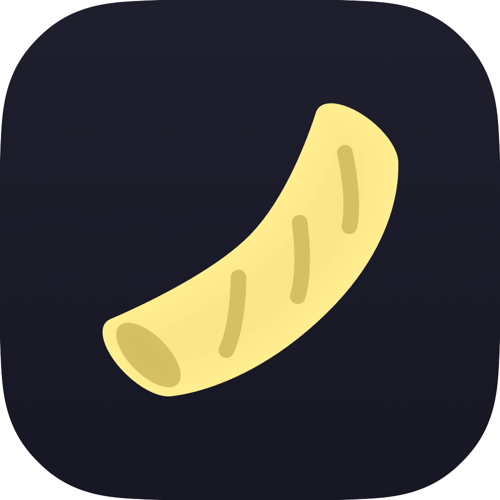
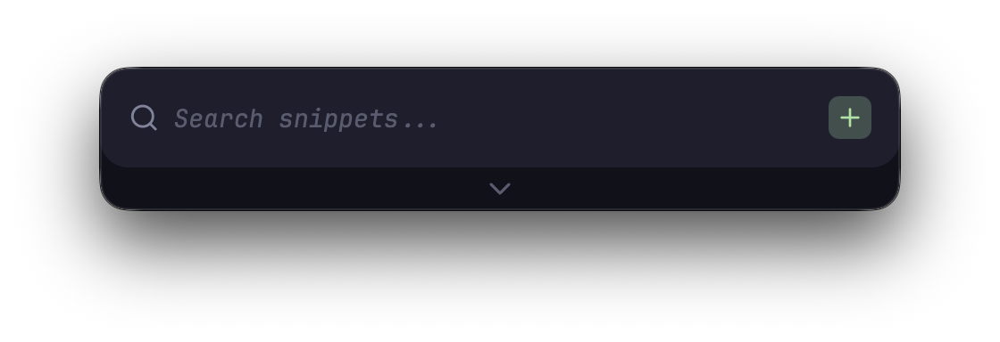
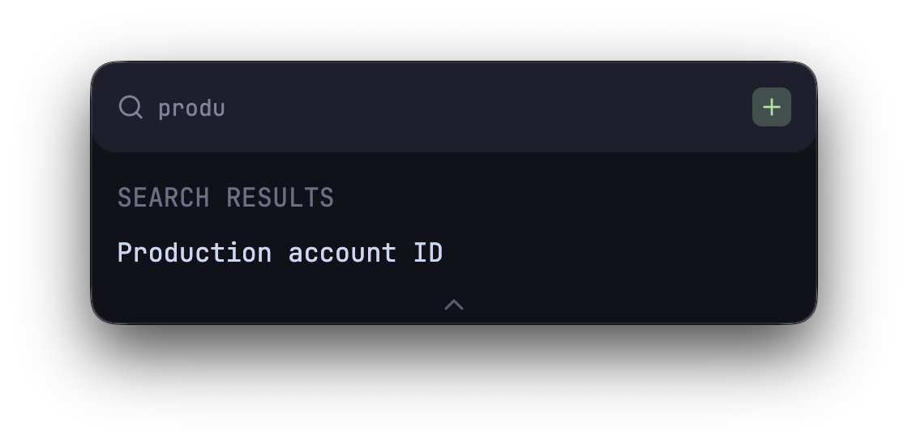
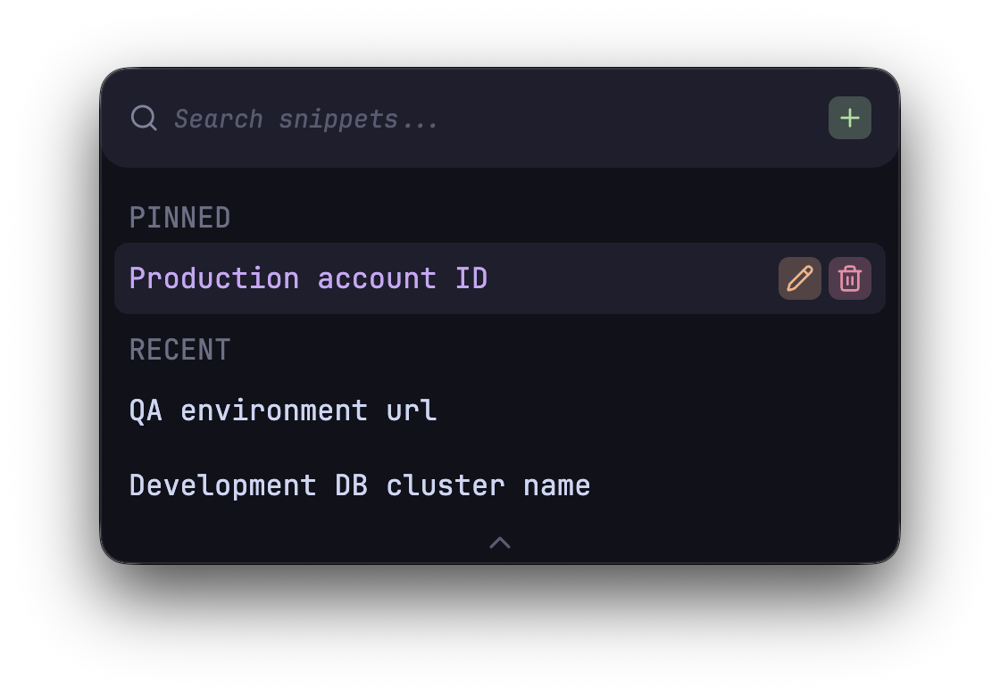
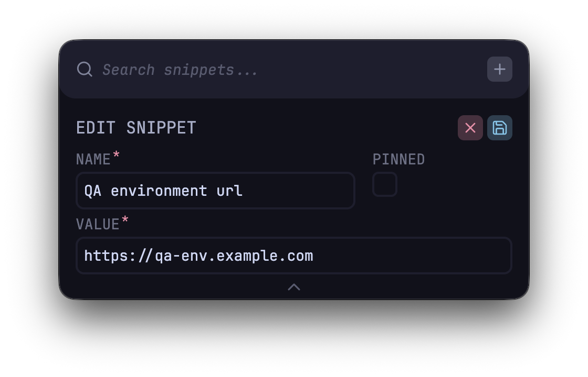

<div align="center">
  
  <br/>
  <h3>
    rigatoni
  </h3>
  <p>
    Electron-based macOS app for pasting frequently used values.
  </p>
</div>

## Why 'rigatoni'?

Copy paste &rarr; copypasta &rarr; pasta &rarr; rigatoni (aka the best pasta shape).

## Gallery

<div align="center">
  <div>
    
    
  </div>
  </br>
  <div>
    
    
  </div>
</div>

## Development

### Quick Start

Ensure you're using the correct version of node

```bash
# e.g., via the .nvmrc file with nvm (currently set to 26)
nvm use
```

Install dependencies

```bash
npm install
```

**Building the app for development**

```bash
# builds the frontend with Vite (out to /dist-react)
# and transpiles electron files to js (out to /dist-electron)
npm run build
```

Run the Vite dev server

```bash
npm run dev:react
```

In another terminal window, run electron

```bash
npm run dev:electron
```

**Building the app for production**

Use `electron-builder` to package the app

```bash
# macOS with an M-series processor is currently the only supported platform
# the following will output the built application to /dist
npm run dist:mac
```

After building with `electron-builder`, the `/dist` folder will contain both the `.dmg` installer, as well as `rigatoni.app` which you can run directly from `/dist/mac-arm64`

### Project Structure

```plaintext
src/
├── electron/
│   ├── constants/
│   │   └── window.ts
│   ├── ipc/
│   │   ├── index.ts
│   │   ├── snippet.ts
│   │   ├── window.ts
│   │   └── window.test.ts
│   ├── utils/
│   │   ├── example-utility.ts
│   │   └── example-utility.test.ts
│   ├── main.ts
│   ├── preload.cts
│   └── tsconfig.json
├── shared/
│   ├── schemas/
│   │   └── snippet.ts
│   ├── types/
│   │   └── globals.ts
│   └── ipc-channel.ts
└── ui/
    ├── api/
    │   └── snippet/
    │       ├── mutations.ts
    │       └── queries.ts
    ├── assets/
    │   └── fonts/
    │       └── example-font.woff2
    ├── components/
    │   ├── ExampleComponent/
    │   │   └── index.tsx
    │   └── inputs/
    │       └── ExampleInput/
    │           └── index.tsx
    ├── hooks/
    │   └── use-dimensions.ts
    ├── types/
    │   └── colour.ts
    ├── utils/
    │   ├── example-utility.ts
    │   └── example-utility.test.ts
    ├── App.tsx
    ├── index.css
    └── main.tsx
```

## License

rigatoni is licensed under the [MIT License](LICENSE)
